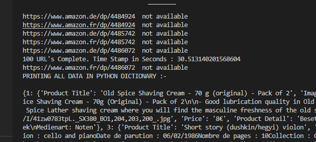

# Python-URL-Scrapper
Python URL Data  Scrapper from a give file or urls in CSV file

## Technologies used
```selenium```
```postgresql```

## Usage
1. Clone this project git clone https://github.com/sharmaruchi30/Python-URL-Scrapper.git and cd into it cd Python-URL-Srapper
2. Install requirements - 
 ```pip install selenium ```
 ```pip install psycopg2 ```
 
## Provided CSV file for Data Scraping
 ```Amazon Scraping - Sheet1.csv``` 

## Aproach to the solution
### Tasks:-
1. 404 Error
 - for this we need to check if the page return the 404 error in the web page, but due to Amazon's Clever puppy filled 404 error page it is quite difficult to detect the 404 status code. So, I decided to get the output of console.log from the web page and got the error message and compared with the console.log output by python if tne output returns the 404 message it prints 'URL Not Found', And it worked for me.
 
 2. Getting Data
 - To get data I used selenium properties, I used try and except blocks to handle errors at this stage as not all the pages have same Id and Class Names.

3. Storing the Data
 - I first stored all the Data in a dictionary and then created a json file for the same (as mentioned in the task).
 - Stored all the data in a database connecting to postgresql
 
4. Printing Time taken 
- Time Taken is printed after every 100 urls scraped by the program.
- On an average time taken for every 100 urls is 30 seconds.

## Scraped Data
- Check URLSDATA.json file

## Output
Screenshot of terminal output -




Note : Please Note this program will not work in the latest stable version of chrome which is 103 due to some bugs in that version as of now, I used chrome's older version  102.0.5005.63. However we can use chrome's beta version to run this program. 
